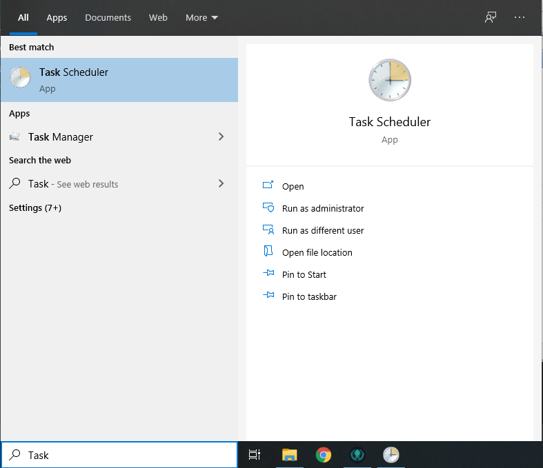
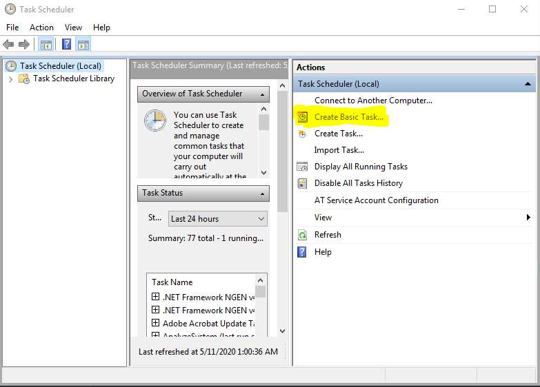
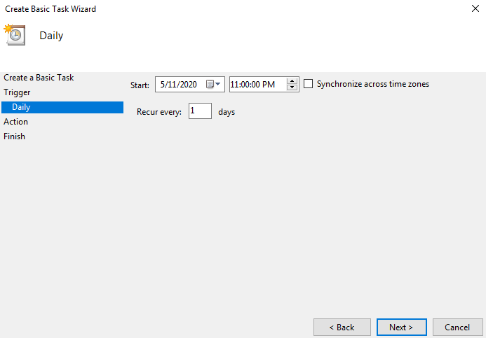
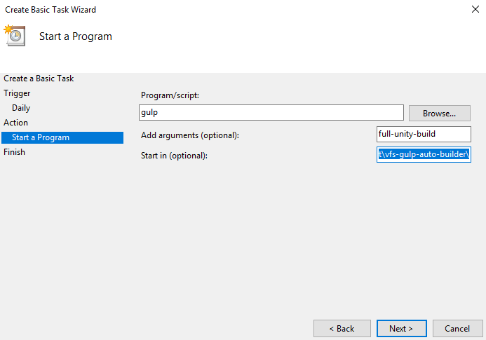
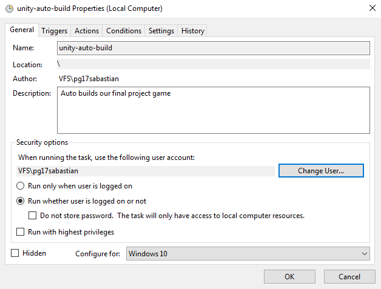
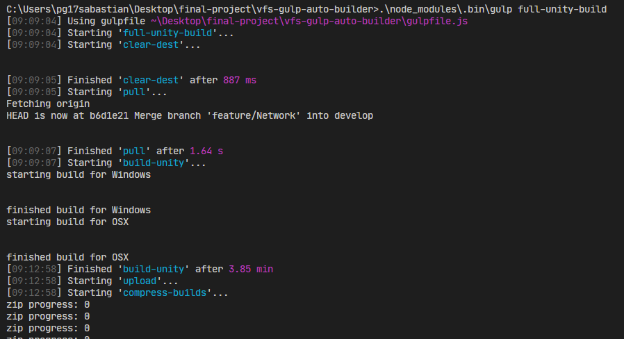
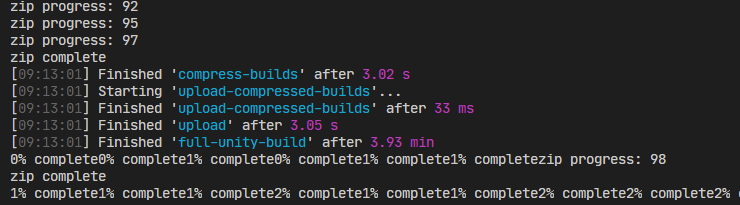
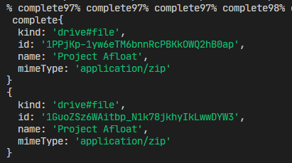

# Unity Build Tool <!-- omit in toc -->

> Build tool for building Unity games with NaturalDocs documentation. 
> The game must be hosted on a git repo (Github use case explained here). 
> Builds are automatically compressed and uploaded to Google Drive after being built.
> This tool will only run on windows, but can build for Windows, OSX and Linux. 

### Table of Contents

- [Project Setup](#project-setup)
  - [GitHub Auth Setup](#github-auth-setup)
  - [Google Auth Setup](#google-auth-setup)
  - [Natural Docs Setup](#natural-docs-setup)
  - [<div style="display: inline">Itch.io</div> Setup](#div-style%22display-inline%22itchiodiv-setup)
  - [Task Scheduler Setup](#task-scheduler-setup)
- [Example Output](#example-output)
- [Notes for Next Iteration](#notes-for-next-iteration)

## Project Setup

- `npm install -g gulp-cli`
- ensure you have the right version of your game engine install for builds 
- in project folder:
  - `npm install`
- `git lfs install`
  - this [needs to be run once per user account per computer](https://git-lfs.github.com/)

### GitHub Auth Setup
- goto your github profile's settings page
- goto developer settings
- goto Personal Access Token
- create a token with full `repo` and `gist` privelages
- create file `config.git.js` in project root
- add the following content:
  ```javascript
  module.exports = {
      username: "YOUR USERNAME HERE",
      password: "YOUR PERSONAL ACCESS TOKEN HERE"
  };
  ```


### Google Auth Setup

- Goto your [Google API Console Credentials Screen](https://console.developers.google.com/apis/credentials/)
- choose to make a OAuth credentials with: `Create Credentials > OAuth client ID`
- choose type `Other` (this is for installed applications, or this console test)
- download the Client with `Download JSON` and name it `credentials.json`
- place this file in the root of this project
- `npm run auth` to authorize yourself


### Natural Docs Setup
- download the [NaturalDocs zip](https://www.naturaldocs.org/download/)
- create a folder called `bin` in project root and a `NaturalDocs` folder inside of that
- unzip the folder so that `NaturalDocs.exe` is at the path `.\bin\NaturalDocs\NaturalDocs.exe`
- from this point, the docs should be all setup
  - if not, init the docs with `.\node_modules\.bin\gulp docs-init`
- you can customize your project's setting in `.\natural-docs-config\Project.txt`
- link to [full official guide](https://www.naturaldocs.org/getting_started/getting_set_up/#starting_a_new_project)


### <div style="display: inline">Itch.io</div> Setup <!-- div is to prevent url showing up -->
- download the [itch.io butler zip](https://itch.io/docs/butler/installing.html)
- Inside of the same `bin` folder as Natural Docs, add a `ItchioButler` folder
- unzip the folder so that `butler.exe` is at the path `.\bin\ItchioButler\butler.exe`

### Task Scheduler Setup

- here's a link to [a more complete guide](https://www.digitalcitizen.life/how-create-task-basic-task-wizard)
  - and here's a link for [setting this up automatically](https://stackoverflow.com/questions/1020023/specifying-start-in-directory-in-schtasks-command-in-windows)







> ^ NOTE: this image is incorrect.
> 
> - `Program/script`: `"cmd.exe"`
> - `Add arguments (optional)`: `/c ".\node_modules\.bin\gulp full-unity-build"`
> - `Start In`: path of the folder with the gulp script
>   - ie. if `a/b/c/gulpfile.js` is the path to the gulpfile, put `a/b/c` in this field
> 
> This runs a new *Command Prompt* that will run our gulp build script
>
> If building with unreal, do a "full-unreal-build" instead of unity




## Example Output






## Notes for Next Iteration

- Make the build gulpscript seperate from the script that builds for each platform
  - When the gulp script handles this, if even one of the builds or tests fails, the whole thing comes crashing down
  - Instead, have once central script that calls a new instance of the build script for each one of the (what Unity calls) Build Targets
  - This way if one fails, the process may continue
- Seperate out functions that are Build Target specific (they depend on the build succeding) from ones that arent
  - For example, no matter which build fails, we still need to (a) pull latest and (b) try to update the code docs
  - Function that are build dependant are (a) building the exe, (b) zipping the file and (c) uploading the file
  - There are cases missing, but this is the general idea
- Create a logs file for some buffer # of days (3?)
  - When a build goes wrong, it can be difficult to figure out why
- Make the builder only run based of the master branch on Git
  - Right now, this builder is based on develop, but never auto-updates
  - In future, make it based off of master so we know the builds will always work reliably
  - As well, before we do any building of the games, check to see if there's an update to the builder repo (get latest)
- Make sure gulp tasks have a consistent naming scheme
  - ie. "build-unity" and "full-unity-build" are confusing
  - either do "build-unity" and "build-unity-full" or "full-unity-build" and "unity-build"
- Don't use %cd%, get the path using Node.js it's more reliable and platform agnostic
- Don't worry about other teams and trying to work around the Minimum Viable Product
  - Do just what we need, and once that works cleanly cut it down until it works good for all teams
