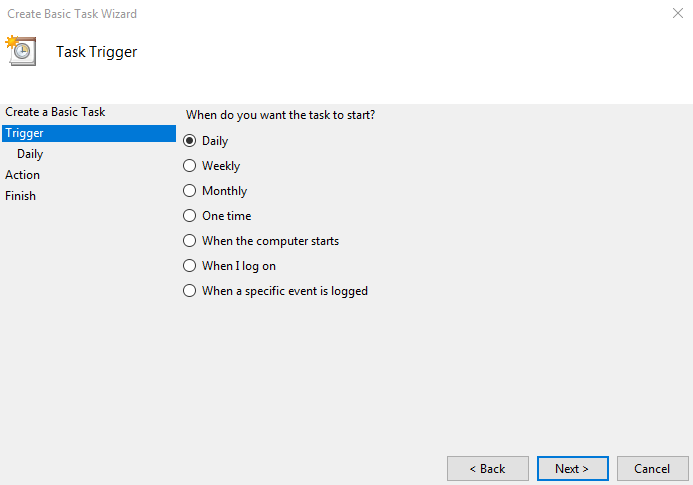

### Project Setup

- `npm install -g gulp-cli`
- ensure you have the right version of your game engine install for builds 
- in project folder:
  - `npm install`
- `git lfs install`
  - this [needs to be run once per user account per computer](https://git-lfs.github.com/)

### GitHub Auth Setup
- goto your github profile's settings page
- goto developer settings
- goto Personal Access Token
- create a token with full `repo` and `gist` privelages
- create file `config.git.js` in project root
- add the following content:
  ```javascript
  module.exports = {
      username: "YOUR USERNAME HERE",
      password: "YOUR PERSONAL ACCESS TOKEN HERE"
  };
  ```


### Google Auth Setup

- Goto your [Google API Console Credentials Screen](https://console.developers.google.com/apis/credentials/)
- choose to make a OAuth credentials with: `Create Credentials > OAuth client ID`
- choose type `Other` (this is for installed applications, or this console test)
- download the Client with `Download JSON` and name it `credentials.json`
- place this file in the root of this project
- `npm run auth` to authorize yourself


### Task Scheduler Setup

- here's a link to [a more complete guide](https://www.digitalcitizen.life/how-create-task-basic-task-wizard)
  - and here's a link for [setting this up automatically](https://stackoverflow.com/questions/1020023/specifying-start-in-directory-in-schtasks-command-in-windows)





> ^ NOTE: this image is incorrect.
> 
> - `Program/script`: `"cmd.exe"`
> - `Add arguments (optional)`: `/c ".\node_modules\.bin\gulp full-unity-build"`
> - `Start In`: path of the folder with the gulp script
>   - ie. if `a/b/c/gulpfile.js` is the path to the gulpfile, put `a/b/c` in this field
> 
> This runs a new *Command Prompt* that will run our gulp build script
>
> If building with unreal, do a "full-unreal-build" instead of unity


